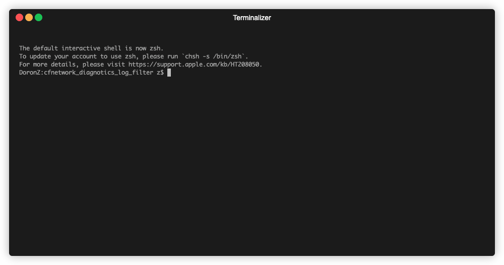

# Description

Inspired by [harlogger](https://github.com/doronz88/harlogger), this tool takes advantage of Apple's own
public profiles to sniff the headers of every HTTP request/response. Unlike harlogger, this tool doesn't rely 
on a jailbroken device - meaning anyone with an iOS device can use it freely.

# Setup

- Download Apple's CFNetwork profile which can be found here:
    https://developer.apple.com/services-account/download?path=/iOS/iOS_Logs/CFNetworkDiagnostics.mobileconfig

- Install it via any way you prefer. I'm using `pymobiledevice3`:

    ```shell
    # if you don't already have it
    python3 -m pip install -U --user pymobiledevice3
    
    # install the profile
    pymobiledevice3 profile install CFNetworkDiagnostics.mobileconfig
    ```
- Install `requirements.txt`
     ```shell
    python3 -m pip install -r requirements.txt
    ```

- That's it! :) You can now just start sniffing out everything using:
    ```shell
    python3 main.py
    ```

# Example




